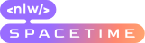

Nlw Spacetime, uma aplicação para armazenar memórias criadas pelo usuário, essas memórias são armazenadas com uso de timeline (dia, mês e ano), uma imagem ou vídeo e com um texto explicando o momento marcante.  

<h1 align="center"></h1>

## Executar na máquina local
  1. Instalar dependências
  * Dentro de cada pasta server/web/mobile 
    - → npm install
  2. Iniciar dev server
  * Dentro da pasta server
    - → npm run dev
  3. Iniciar dev web
  * Dentro da pasta web
    - → npm run dev
  4. Iniciar dev mobile
  * Dentro da pasta mobile
    - → npx expo start
  * Se precisar limpar o cache
    - → npx expo start --clear

## Tecnologias

Tecnologias utilizadas

* HTML
* CSS
* Javascript
* Typescript
* Tailwind
* Nextjs

## Casos de uso pela NLW

* Registrar usuário com o uso do github OAuth
* Clicar em um link e poder criar uma memória adicionando a data atual, se será pública ou não, uma imagem/vídeo e um texto
* Mostrar uma seção onde mostre todas as memórias criadas por esse usuário
* Ao clicar Ler mais... em uma memória mostrar uma seção da memória escolhida
* Na seção da memória escolhida mostrar a data a qual a memória foi criada a imagem/vídeo dessa memória, e um texto completo

## Casos de uso adicionados pelo desenvolvedor

Já concluído
* Armazenar imagem/vídeo em Cloudinary, invés de dentro de uma pasta do projeto
* Retornar com uma mensagem de erro caso a imagem/vídeo seja muito grande
* Remover a imagem/vídeo caso seja muito grande
* Adicionar a página para cada memória

Não concluído
* Adicionar a capacidade de modificar a timeline (o momento da memória) utilizando um calendário 

### Licença 

Projeto sob licença MIT.
